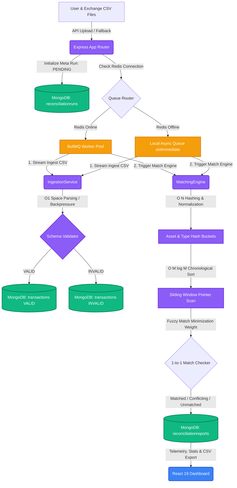

# 📊 Reconcile.IO — Transaction Reconciliation Engine

[](https://nodejs.org/)
[](https://www.typescriptlang.org/)
[](https://react.dev/)
[](https://expressjs.com/)
[](https://www.mongodb.com/)
[](https://redis.io/)
[](https://bullmq.io/)
[](https://vite.dev/)

**Reconcile.IO** is an enterprise-grade, high-throughput **Transaction Reconciliation Engine** engineered in **TypeScript** using **Node.js**, **Express**, and **MongoDB**. Designed to ingest, normalize, and reconcile massive crypto-transaction datasets from multiple external sources (e.g., user-exported CSV ledger data vs. exchange-generated transaction receipts), it guarantees high data integrity, strict auditability, and sub-linear processing speeds.

The application includes a beautiful, premium **Verification Dashboard** built with **React 19** and **Vite** for triggering runs, visualizing match summaries, monitoring processing speeds, and auditing data quality in real time.

---

## 🏗️ System Architecture & Workflow

The diagram below details the data flow from CSV uploading to ingestion validation, task queueing, database storage, matching optimization, and presentation layers:



---

## ⚡ Core Technical Features

### 1. High-Performance $O(N \log N)$ Matching Engine
* **Pre-Indexed Hashing**: Rather than executing nested iterations over the entire dataset ($O(N^2)$), transactions are partitioned into memory hash buckets keyed by normalized assets and transaction types (e.g., `BTC_BUY`).
* **Chronological Sliding Window Search**: Inside each bucket, transactions are sorted in $O(M \log M)$ time (where $M \ll N$). A dual-pointer sliding window sweeps chronologically through the array, breaking early if the timestamp exceeds the configured limit ($\pm T$ seconds), minimizing comparisons.
* **Greedy 1-to-1 Collision Resolver**: For situations where multiple matching candidates exist, a multi-factor fuzzy distance metric is computed using normalized deviations:
  $$\text{Match Weight} = \frac{\text{Time Difference}}{\text{timestampTolerance}} + \frac{\text{Quantity \% Difference}}{\text{quantityTolerancePct}}$$
  The candidate pair yielding the **lowest weight** is paired and immediately locked, avoiding duplicate matching.

### 2. Stream-Based Ingestion with Dynamic Backpressure Flow Control
* **$O(1)$ Memory Consumption**: CSV datasets are parsed using Node.js stream pipelining (`fs.createReadStream` paired with `csv-parser`), avoiding memory spikes or garbage collection freezes for files containing millions of rows.
* **Dynamic Flow Control**: When the parser fills an in-memory buffer of $1,000$ documents, the stream is paused (`stream.pause()`). It performs a MongoDB bulk insert (`insertMany`) and resumes parsing (`stream.resume()`) once written, maintaining a bounded memory footprint.
* **No Silent Ignorance**: Invalid transactions (missing IDs, malformed timestamps, or negative amounts) are preserved with status `INVALID` along with their error reason in MongoDB, creating a clean audit trail.

### 3. Resilient Hybrid Task Queue (BullMQ + Redis Failover)
* **Production-Grade Queue**: In production mode, tasks are dispatched through **BullMQ** (powered by **Redis**), featuring a concurrency scale of $2$ workers, job completion garbage collection, and custom exponential backoff configurations.
* **Dynamic Failover**: If Redis is unavailable, the queue system automatically detects the state via an `IORedis` retry interceptor, printing a system warning and routing tasks to a local **Asynchronous In-Memory Worker** using `setImmediate()`. This guarantees zero-config application runs in offline dev environments.

### 4. Enterprise APIs & Telemetry Logs
* **Real-time API telemetry**: Reports record granular execution stats including overall throughput (rows processed per second), ingestion speed, matching duration, and precise database transaction counts.
* **Stream-Based CSV Report Generation**: Includes a CSV builder that generates downloadable compliance-ready reports mapping matched pairs, conflicting fields, and orphaned ledger rows.
* **System Socket Cleanup**: Listens to system termination signals (`SIGINT`, `SIGTERM`) to release active Express ports, flush Redis pools, and cleanly disconnect Mongoose connections, preventing orphaned background processes.

---

## 🛠️ Step-by-Step Installation Guide

### Step 1: Clone the Repo & Configure Environment Variables
Copy the template `.env.example` in the project root to create your `.env` configuration file:
```bash
cp .env.example .env
```
Inside your `.env` file, adjust the database configurations and matching thresholds:
```env
PORT=3000
MONGO_URI=mongodb://127.0.0.1:27017/reconciliation_engine

# Tolerances defaults
TIMESTAMP_TOLERANCE_SECONDS=300
QUANTITY_TOLERANCE_PCT=0.01

# Queue credentials
REDIS_HOST=127.0.0.1
REDIS_PORT=6379
```

---

### Step 2: Spin Up MongoDB & Redis
You can run the supporting database and memory store either locally or inside Docker containers.

#### Option A: Docker (Fastest)
Ensure you have Docker running, then start the containers:
```bash
# Start MongoDB Container
docker run -d -p 27017:27017 --name local-mongo mongo:latest

# Start Redis Container (Optional - system falls back to In-Memory Queue if offline)
docker run -d -p 6379:6379 --name local-redis redis:alpine
```

#### Option B: Native Installation
* **MongoDB**: Download and install [MongoDB Community Edition](https://www.mongodb.com/try/download/community). Ensure it is configured to run as a network service on port `27017`.
* **Redis**: Install Redis natively on Linux/macOS or run via Windows Subsystem for Linux (`wsl sudo apt-get install redis`).

---

### Step 3: Install Dependencies & Run Server
Install package dependencies for both the Backend and Frontend, then start the servers:

#### Backend Server
```bash
# Install backend dependencies
npm install

# Start in development hot-reload mode
npm run dev

# Start in production mode (compiled TypeScript)
npm run build && npm start
```

#### Frontend Dashboard (Vite dev server runs alongside on port `5173`)
```bash
# Navigate to the frontend directory
cd frontend

# Install frontend dependencies
npm install

# Run the Vite Dev server
npm run dev
```

Open your browser and navigate to: **`http://localhost:5173`** (or `http://localhost:3000` depending on your routing setup) to interact with the Dark Mode dashboard!

---

## 📡 REST API Documentation

All REST routes are prefixed with `/api`.

| Method | Endpoint | Description | Request Body / Params |
| :--- | :--- | :--- | :--- |
| **POST** | `/api/reconcile` | Queues or executes the reconciliation run. Supports dynamic tolerances. | Form-data: `userCsv` (file), `exchangeCsv` (file), `timestampTolerance` (number), `quantityTolerancePct` (number). If files are omitted, defaults in the project root are parsed. |
| **GET** | `/api/runs` | Fetches a historical list of all reconciliation execution runs sorted by timestamp in descending order. | None |
| **GET** | `/api/report/:runId` | Returns execution run stats, matched entries, conflicting entries, and data invalidation logs. | Path param: `runId` |
| **GET** | `/api/report/:runId/summary` | Fetches aggregated counts of matched, conflicting, and unmatched records. | Path param: `runId` |
| **GET** | `/api/report/:runId/unmatched` | Isolates and returns only unmatched records (exists only in user or only in exchange exports). | Path param: `runId` |
| **GET** | `/api/report/:runId/download` | Exports the reconciliation results directly as a downloadable, compliance-ready CSV file. | Path param: `runId` |

---

## 📊 Data Quality & Validation Matrix

All incoming records are piped through the schema validator inside IngestionService. If any validation check fails, the transaction is marked as `INVALID` and recorded in the database:

| Ingestion Parameter | Validation Check | Invalidation Status | Audit Error Message |
| :--- | :--- | :--- | :--- |
| **Transaction ID** | Missing or blank | `INVALID` | `"Missing transaction_id"` |
| **Timestamp** | Missing or blank | `INVALID` | `"Missing timestamp"` |
| **Timestamp Format** | Malformed date string | `INVALID` | `"Malformed timestamp: \"...\""` |
| **Quantity** | Missing or blank | `INVALID` | `"Missing quantity"` |
| **Quantity Number** | Value is not a valid floating-point number | `INVALID` | `"Invalid quantity (not a number): \"...\""` |
| **Quantity Range** | Negative numeric values | `INVALID` | `"Negative quantity: ..."` |
| **Asset Name** | Missing or blank | `INVALID` | `"Missing asset type"` |

---

## 🧮 Reconciliation Matching Categories

Every record ingested is evaluated and routed into one of four states:

1. **`MATCHED`**: Pairs successfully matched within the tolerances specified.
2. **`CONFLICTING`**: Pairs that failed matching tolerances but exist within **10x** the tolerance range. This acts as a near-miss checker and highlights discrepancies (e.g., small price/fee differences or human errors).
3. **`UNMATCHED_USER`**: Ledger entry exists only in the user's uploaded ledger.
4. **`UNMATCHED_EXCHANGE`**: Ledger entry exists only in the exchange's exported spreadsheet.

---

## ⚙️ Matching Logic Normalization Layer

Before matching, properties are normalized inside Matching Engine:

* **Asset Normalization**: Maps name variants to unified ticker codes. E.g., `bitcoin` or `btc` converts to `BTC`; `ethereum` or `eth` converts to `ETH`.
* **Transaction Type Mapping**: Standardizes perspectives. User `TRANSFER_OUT` and Exchange `TRANSFER_IN` are normalized to a common type of `TRANSFER` so they can be matched.
